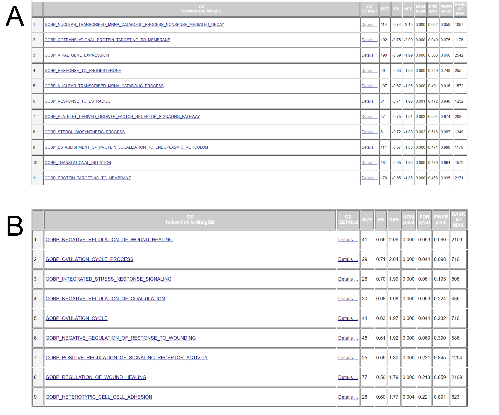
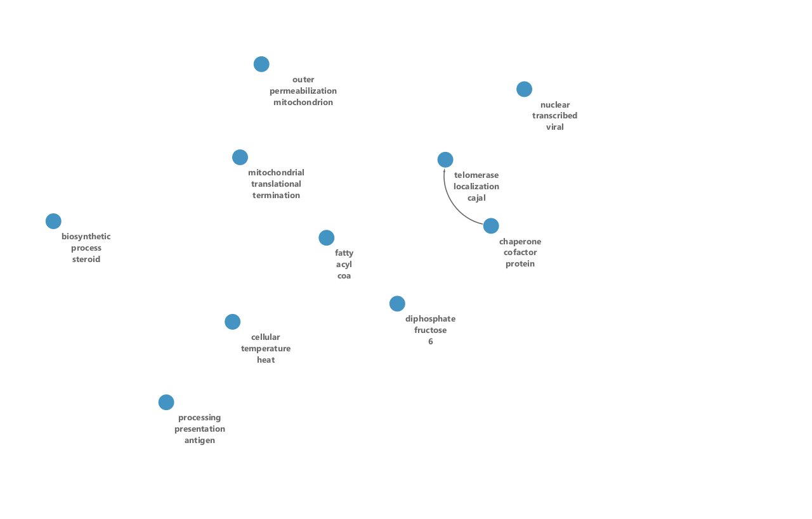

## Introduction
For this analysis, the data set of interest is entitled "Analysis of the transcriptome and DNA methylome in response to acute and recurrent low glucose in human primary astrocytes (RNA-Seq)"^1^, and can be accessed on the GEO database here: [GSE166847](https://www.ncbi.nlm.nih.gov/geo/query/acc.cgi?acc=GSE166847)^2^. This data set contains gene expression levels in human astrocytes (a type of glial cell) as a result of recurrent treatments of low glucose (hypoglycemia), which is a very frequent side effect of insulin treatment for diabetes. This is an RNA-Seq data set.

Human astrocyte cells were treated with either one, three, or four rounds of low glucose (only 0.1mmol/L) for three hours at a time for each day of treatment. On the fourth day, RNA was collected from each sample and sequenced. The control samples did not receive any rounds of low glucose, and were were grown consistently with normal levels of 2.5mmol/L glucose. There are 5 replicates for each treatment. Here’s an overview of the experiment:

| Treatment Name     | Treatment Rounds | Treatment Order (mmol/L per day) | 
| ------------- |:-------------:|:-------------:|
| Control (CONT)      | 0 | 2.5->2.5->2.5->2.5 |
| Hypoglycemia (HYPO)     | 1      | 2.5->2.5->2.5->0.1 |
| Antecedent Hypoglycemia (AH)  | 3      | 0.1->0.1->0.1->2.5 |
| Recurrent Hypoglycemia (RH)  | 4      | 0.1->0.1->0.1->0.1 |

Reference paper: https://www.biorxiv.org/content/10.1101/2020.07.07.191262v1.full
(*Note: this article is a pre-print*)

The overall goal of this analysis is to reveal which pathways and genes are overexpressed as a result of differing treatments of low glucose.

#### Normalization and Cleaning

The data was cleaned by removing low expression genes (genes with a total count of less than $n=5$ across all replicates for a given treatment), and the cleaned data was ultimately normalized using the Trimmed Means of M-values (TMM) technique. This normalization procedure allows us to reduce variance between samples so that we can compare treatments across different replicates. All in all, the original data did not change much, but the variance was reduced slightly, which is a good thing. Here's the distribution of our samples in the form of a box plot:

We can see from these summary plots that our data is very evenly distributed across treatments and replicates. As another measure of comparability, let's look at an MDS plot of our replicates and treatments:

As we can see from the MDS plot, our replicates are very well clustered across ALL treatments, with a few slightly tighter clusters based on each treatment, which is to be expected. This indicates that our samples are able to compared accurately, as the variance (distance on this plot) between the samples is relatively low.

#### Threshold Over-Representation Analysis
After normalizing and cleaning our counts, the data was run through the `exactTest` method from the `edgeR` package. This yielded P-values for all our treatments, indicating which genes were significantly over or under expressed. The threshold for significance was set at P-value<0.05. These volcano plots illustrate the significant hits for all treatments quite nicely:

Next, all genes that had a P-values less than 0.05 for each treatment were compiled into an unordered text file. Different files were compiled for overexpressed genes, underexpressed genes, and a combination. These text files were then run through [g:Profiler](https://biit.cs.ut.ee/gprofiler/gost)^3^, with a threshold of 0.05 using Benjamini-Hochberg correction. I chose to look only at the "GO biological process" annotations for my genesets (unsure which version, but g:Profiler indicates that they were last updated on 2020-12-08). Here is a brief summary of the prominant informative genesets for all treatments:

| Treatment Name     | Overexpressed | Underexpressed |
| ------------- |:-------------:|:-------------:|
| Low Glucose (HYPO)     | ER-nucleus signaling pathway; regulation of programmed cell death | protein targeting to ER; cotranslational protein targeting to membrane |
| Recurrent Low Glucose (RH)  | NULL | protein targeting to ER; cotranslational protein targeting to membrane |
| Antecedent Low Glucose (AH)  | protein targeting to ER; cotranslational protein targeting to membrane | cellular component organization |

It seems that there is an obvious trend where the low glucose and recurrent low glucose treatments have a significant number of endoplasmic reticulum targeting and translation genesets that are downregulated. As well, the low glucose treatment sees and upregulation of genesets that are involved in apoptosis and stress response, as well as unfolded protein response. We see a reverse of this in the antecedent low glucose response, with upregulation of endoplasmic reticulum associate factors and translation factors, likely because the low glucose conditions have been recently alleviated in this treatment.

## Non-Thresholded Gene set Enrichment Analysis
*Note that I opted to use the GUI programs for both GSEA and Cytoscape*

The ranked gene list generated in Assignment #2 was run through the GSEAPreranked program^4^. The genes were ranked according to their comparative signal strength, and negative values indicated underexpression, whereas positive values indicated overexpression. For GSEAPreranked, I used the built-in GO biological process annotations (v7.4), since I wanted this analysis to be as comparable as possible to my previous thresholded analysis. I also set the "Max size" to 200 and the "Min size" to 15 for each geneset, to make sure the genesets that we get are as relevant and specific as possible. Finally, I left the number of permutations set to the default 1000, and the enrichment statistic was set to "weighted". As expected, very few genesets had a significant FDR hit (we saw the same issue in Assignment #2), but many of them did have highly significant P-values. 

Overall, I attempted to make the comparison to the thresholded results as straightforward as possible by using the same genesets, but there are some inherent differences in the two methods that make it difficult to accurately compare. For instance, the larger number of genes in the ranked gene list causes the FDR threshold to become much more difficult to achieve, and it appears to result in a lot more irrelevant results. Overall though, I think these methods delivered fairly similar results (I'll get into this more below).

#### Low Glucose (HYPO)

Looking at the ranked low glucose results, we can see a very similar pattern to what we saw with the the thresholded results. Our downregulated genes are involved in things like "Cotranslational protein targeting to membrane", "Translational initiation", and "Establishment of protein localization to endoplasmic reticulum". These all indicate a downregulation of ER-associated protein localization and translation in response to a sudden bout of low glucose. In terms of upregulation, we mainly see things like "Integrated stress response". We also see a lot of obviously irrelevant genesets such as those dealing with "wound healing" and "ovulation. This cannot be aplicable here because we are dealing with astrocytes; my assumption is that since we have many more genes in this ranked list, there is more potential for irrelevant false positives like this compared to the thresholded list.

#### Recurrent Low Glucose (RH)

And again, with recurrent bouts of low glucose we see very similar results to the stochastic low glucose above (as we also saw with the thresholded results). We again see things like "Cotranslational protein targeting to membrane", and "Establishment of protein localization to endoplasmic reticulum" being downregulated. There are a lot of difficult to discern genesets that are upregulated, but in an interesting way they seem to be loosely associated with negatively regulating proliferation. We don't really have a point of comparison for this RH treatment with the thresholded list, because that list did not return *any* significantly upregulated genesets. So we should take these results with a grain of salt. These upregulated genes also have very high FDR Q-values, which makes them almost worthless.

#### Antecedent Low Glucose (AH)

Finally, once again confirming the results seen from the thresholded lists, we see a reversal of the above phenomenon. ER, localization, and translation genesets are now all *up*regulated with the antecedent treatment, which makes sense, since the cells have had time to recover from their bouts of low glucose and are able to ramp up their translational machinery once again. The downregulated genes this time seem to be heavily involved in regulating cellular structure and cell shape. Particularly, the HIPPO pathway is very strongly associated with cell shape and movement^5^. This makes sense, as low glucose is likely to cause a stress response and perhaps slight movement of the cell; the return of glucose reverses this process.

Overall, the results seen here from the ranked list are incredibly similar to the results from the thresholded list, with a few notable exceptions. For one, there were a much higher number of irrelevant and obviously incorrect genesets, likely due to the presence of a large number of additional genes compared to the thresholded lists.

The comparison was as straightfoward as I could make it, since I used the same annotation set, but again it isn't a totally accurate comparison because the additional genes in the ranked list definitely skew the FDR threshold. 

## Cytoscape Enrichment Map
For each treatment, I fed the above results directly into Cytoscape; I originally set a P-value cutoff of 0.05 and an FDR Q-value cutoff of 0.5, as well setting the similarity cutoff to 0.1 (Jaccard coefficient). Although, with these settings I noticed that my graphs were being dominated with metabolic processes, and since these are inherently the most interconnected pathways within any cell, I decided to make the P-value cutoff more stringent at 0.005. This gave me more interpretable results; I have included a general overview of both cutoffs but I used the more stringent, smaller network for my deeper theme analysis.

In terms of annotations, I used the AutoAnnotate app. I kept most settings as default, with the cluster algorithm being "MCL Cluster", and the edge weight column set to "similarity_coefficient". The labeling algorithm was the WordCloud "Adjecent Words" method. The maximum number of annotations was set to 10 to avoid labeling any singletons.

#### Low Glucose (HYPO)
Here's a look at the low glucose networks (0.05 P-value and 0.005 P-value respectively) without any annotations:

There's definitely a dramatic difference between the number of nodes in the less stringent cutoff compared to the more stringent cutoff. I found that there were way too many metabolic processes cluttering the graph at the looser cutoff. Overall though, we can see that most of these clusters are very self contained. There does not seem to be very much inter-cluster connections. Next, I annotated the clusters using AutoAnnotate (descibed above):

These geneset annotations give us even more insight into the overarching mechanism behind our results. We seem to have more annotations associated with the nucleus than we have seen previously, and the metabolic process is quite prominent as well (which makes sense, since glucose is a primary nutrient). Interestingly, we have a cluster of downregulated genesets corresponding to "anaphase promoting complex"; this seems to be implicate low glucose in disrupting some mitotic processes (will explore this later on). We also have some strange clusters like "wound healing coagulation", but this is likely just a mislabel, or an artefact of some of our irrelevant GSEA results. Now, to see how these *clusters* are connected to each other, we can take it one level above and look at a "theme network":

It's very interesting to see these connections here; it seems that the "nuclear transcribed protein" cluster is very well connected to other protein processes, as well as the anaphase cluster. It seems that there may be more interconnectedness than I had anticipated. There seems to be an interesting interplay between downregulation of translation, nuclear-associated proteins, and the cell cycle in general.

#### Recurrent Low Glucose (RH)
And here's a look at the recurrent low glucose networks (0.05 P-value and 0.005 P-value respectively) without any annotations:

We see a similar pattern in these recurrent low glucose networks as we saw above, but there do seem to be more connections in the more stringent network. Also, it's striking that there are no upregulated genes at all in this network. This makes sense, sense all the upregulated genes in the GSEA results had an FDR equal to 1.0! So naturally, they didn't make our (generous) cutoff of 0.5. Nonetheless, these downregulated geneset clusters should still be interesting. Here are the annotated clusters:

This network seems quite a bit more murky than the low glucose network above...there seem to be some strange annotations dealing with "viral" and "antigen". But, there are also some familiar themes. For example, we have "mitochondrial translational termination", which may suggest the downregulation of certain translational genes, which is what we have come to expect from this treatment. Also, the downregulation of genesets involving "fatty acyl coa" could make sense considering this cell is suffering from recurrent nutrient shortage. Perhaps a theme network will make these annotations more informative:

Unfortunately, there aren't very many interesting connections here. All of these seem fairly disparate, likely because they are simply so many irrelevant clusters here. It may be that the recurrent bouts of low glucose simply cause the effects to be entrenched, and there isn't much significant up or downregulation either way after the 4th consecutive round of low glucose.

#### Antecedent Low Glucose (AH)
Finally, here's a look at the antecedent low glucose networks (0.05 P-value and 0.005 P-value respectively) without any annotations:

These networks are by far the most interesting that we have seen. There seems to be quite a good mix of upregulated and downregulated genes, and there seems to be some good cross-cluster connections. Here are the resultant geneset cluster annotations:

Again, these annotated clusters are very interesting and informative. We have an upregulation in translation associate genesets, and there seems to be a very clear downregulation of growth and adhesion genesets, echoing what we saw with the GSEA results. This is interesting because we didn't really see any of these growth genesets in the thresholded analysis. We are also seeing an upregulation of some nucleus-associated genesets, which is the opposite to what we saw in the low glucose treatment. Here is the theme network:

These connections are fairly interesting; it seems clear that the mitochondrial processes would be connected, but the "nuclear transcribed decay" and "peptide antigen mhc" is something I wouldn't have expected. I am a little surprised that there were no shared genes amongst the "cell adhesion substrate" and "growth involved developmental" though. A major novel theme here is definitely the mitochondria, which we really did not see very much of in our thresholded or ranked analyses.

## Interpretation
Linking this all together, we have confirmed the findings in the original paper, that bouts of low glucose activate the unfolded protein response (UPR), which serves to slow down ER-associated translation^6^ through periods of stress. But, we have also seen evidence of the effects on *other* pathways as well. In particular, through the ranked GSEA and Cytoscape clustering analysis, we can see a clear trend of transcriptional downregulation with nucleus associated proteins as a result of low glucose. Tying into this, we can see a downregulation of cell cycle associated genesets (particularly anaphase), which may indicate that bouts of low glucose cause cell cycle arrest or perturbation (this has been shown to be the case in other cell types^7^). We also saw for the first time some evidence of mitochondrial response, with significant upregulation in the antecedent low glucose samples. This sort of mitochondrial disruption has been seen in individuals with diabetes^8^, so it is a good sign that we see it here. Finally, it seems much more clear from this clustering data that there is an effect on metabolism. This seems like an obvious response to a nutrient suddenly becoming scarce, but I did find it interesting that the original paper did not detect expression differences in these types of genes to a high degree.

Wrapping up, it seems that a rough mechanism for astrocyte response to hypoglycemia (low glucose) akin to the conditions often resulting from diabetes treatment is as follows:

* Low glucose shock: URP is initiated, downregulating ER protein localization and ER associated protein synthesis. Stress response genes are upregulated, and genes dealing with cell growth and proliferation are put on hold during this time. Metabolic genes are also downregulated to some degree to account for the lack of nutrients.

* Frequent low glucose: We still have activation of the URP, however we see less expression of stress response, as the effects are becoming entrenched on the cell.

* Recovery from low glucose: We see a near total reversal to the response described above. We now have an upregulation of ER localization and ER translation genes, and a distinct downregulation of stress response genes. It seems that some mitochondrial associated genes are ramped back up, along with metabolic genes. Finally, cell growth and proliferation genes are also enhanced, to take advantage of the new influx of nutrients into the cell.

Hopefully this gives me insights into how to treat the effects of hypoglycemia in those undergoing diabetes treatments. Notably, the mechanisms for hypoglycemia sensing in brain cells (like the astrocytes studied in our case) could be tackled using the results found here and in the original paper.

## Detailed Results
For the last analysis, I am going to do a bit of a deeper dive on a particularly interesting geneset cluster. I will look at the genes associated with the "nuclear transcribed protein" cluster from the low glucose (HYPO) treatment since it is connected to a lot of other clusters and seems to have the largest number of shared genes. To look at the interactions, I am going to use the GeneMANIA^9^ tool in Cytoscape. The Network Weighting was simply set to "GO biological process-based". Here's a total network of these 535 genes involved in this cluster:

Note that for this analysis I only opted to look at pathways and physical interactions. There were *a lot* more potenital interactions, but I thought this was sufficient. As we can see, this cluster has many interconnected and interacting genes. It seems clear that this geneset dealing with nuclear transcribed proteins is incredibly interconnected. In addition, its overlap with translation and ribosome factors indicate that this cluster is quite important in the low glucose response. To look a little more closely, I chose one particular gene in this cluster to hone in on: HSPA5. HSPA5 was one of the genes implicated in the original paper as being involved in the ER stress response. Interestingly, HSPA5 seems to be a type of ribosomal chaperone protein, playing a critical role in protein folding and quality control^10^. Here's a look at the GeneMANIA network from just this one gene (note that I allowed only the 20 closest interacting genes into the network):

This graph is quite interesing, as it shows where HSPA5 associates and what it direcly (or indirectly) associated with. Its strongest pathway association is with ERN1, which is an essential sensor protein for the URP response and ER stress response^11^. HSPA5 also has a physical interaction with HSPA5, indicating that they likely act as a signal receiver (ERN1) and an effector (HSPA5). Another fascinating physical interaction is with SOD1, which is a known regulator of apoptosis^12^. SOD1 and HSPA5 seem to work together frequently to regulate cellular responses to all sorts of stress conditions in brain-associate cells^13^.

We could continue looking at these networks for some time, and they are quite revealing. It all seems to be tied very closely to the stress response, and the cell seems to be dynamic to changing nutrient sources. Certain "expensive" processes like translation are conserved and saved for better conditions.

Unfortunately, I could not find a way to add original P-values or fold changes to the above graph in a systematic way...I spent many hours attempting to figure this out, but it seems that Cytoscape got the best of me.

All in all, a fairly thorough and revealing analysis. I did not expect to find so many novel pathways implicated using Cytoscape, but they did seem to fit quite well into the model (at least when discarding some of the obviously irrelevant annotations).

## References
1. Paul G Weightman Potter, Sam Washer, Aaron R Jeffries, Janet E Holley, Nick J Gutowski, Emma Dempster, Craig Beall. Analysis of the transcriptome and DNA methylome in response to acute and recurrent low glucose in human primary astrocytes. bioRxiv 2020.07.07.191262; doi: https://doi.org/10.1101/2020.07.07.191262

2. https://www.ncbi.nlm.nih.gov/geo/query/acc.cgi?acc=GSE166847

3. Uku Raudvere, Liis Kolberg, Ivan Kuzmin, Tambet Arak, Priit Adler, Hedi Peterson, Jaak Vilo: g:Profiler: a web server for functional enrichment analysis and conversions of gene lists (2019 update) Nucleic Acids Research 2019; doi:10.1093/nar/gkz369

4. Subramanian, Tamayo, et al. (2005, PNAS 102, 15545-15550) and Mootha, Lindgren, et al. (2003, Nat Genet 34, 267-273). https://www.gsea-msigdb.org/

5. Pan D. (2010). The hippo signaling pathway in development and cancer. Developmental cell, 19(4), 491–505. https://doi.org/10.1016/j.devcel.2010.09.011

6. Hetz, C. The unfolded protein response: controlling cell fate decisions under ER stress and beyond. Nat Rev Mol Cell Biol 13, 89–102 (2012). https://doi.org/10.1038/nrm3270

7. Masuda, F., Ishii, M., Mori, A. et al. Glucose restriction induces transient G2 cell cycle arrest extending cellular chronological lifespan. Sci Rep 6, 19629 (2016). https://doi.org/10.1038/srep19629

8. Sivitz, W. I., & Yorek, M. A. (2010). Mitochondrial dysfunction in diabetes: from molecular mechanisms to functional significance and therapeutic opportunities. Antioxidants & redox signaling, 12(4), 537–577. https://doi.org/10.1089/ars.2009.2531

9. Warde-Farley, D., Donaldson, S. L., Comes, O., Zuberi, K., Badrawi, R., Chao, P., Franz, M., Grouios, C., Kazi, F., Lopes, C. T., Maitland, A., Mostafavi, S., Montojo, J., Shao, Q., Wright, G., Bader, G. D., & Morris, Q. (2010). The GeneMANIA prediction server: biological network integration for gene prioritization and predicting gene function. Nucleic acids research, 38(Web Server issue), W214–W220. https://doi.org/10.1093/nar/gkq537

10. https://www.uniprot.org/uniprot/P11021

11. https://www.uniprot.org/uniprot/O75460

12. https://www.uniprot.org/uniprot/P00441

13. Hernández-Ramírez, L. C., Morgan, R., Barry, S., D'Acquisto, F., Prodromou, C., & Korbonits, M. (2018). Multi-chaperone function modulation and association with cytoskeletal proteins are key features of the function of AIP in the pituitary gland. Oncotarget, 9(10), 9177–9198. https://doi.org/10.18632/oncotarget.24183

14. BCB420 2021 Course Notes; by Ruth Isserlin